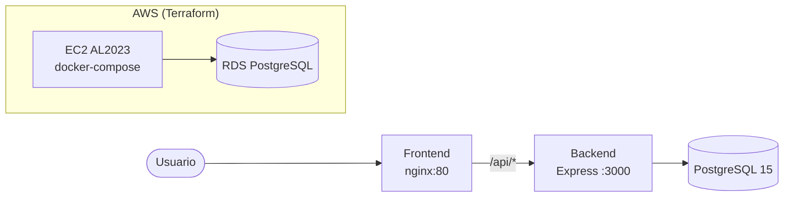

# Mini Trello — Sistema de Gestión de Tareas en Equipo

Aplicación kanban estilo Trello **production-ready** con:

- **Frontend**: React 18 + TypeScript (strict) + Tailwind + React Query + dnd-kit + React Router.
- **Backend**: Node 20 + Express + TypeScript (strict) + Prisma + Zod + Pino.
- **Base de datos**: PostgreSQL 15.
- **Contenedores**: Dockerfiles multi-stage + docker-compose con healthchecks.
- **IaC**: Terraform (AWS EC2 + RDS PostgreSQL, módulos + environments dev/prod).
- **Tests**: Jest (unit backend + frontend con RTL), Supertest (integración), Cypress (E2E con dnd-kit).

## Arquitectura



Local: `frontend (nginx)` → `backend (node)` → `postgres (docker)`.
AWS: `EC2` corre `docker-compose` con frontend+backend; `RDS` aloja la DB.

## Requisitos previos

- Node.js 20+ (`.nvmrc`)
- npm 10+
- Docker + Docker Compose v2 (para la ejecución contenedorizada)
- Terraform 1.5+ + credenciales AWS (solo para despliegue en la nube)

## Estructura

```
gestion-de-tareas/
├── shared/       # tipos y zod schemas compartidos
├── backend/      # Express + Prisma
├── frontend/     # React + Vite + Tailwind
├── e2e/          # Cypress
├── infra/        # Terraform (modules + environments)
└── docker-compose.yml
```

## Ejecutar localmente (sin Docker)

```bash
cp .env.example .env
npm install
# Arranca Postgres local (puedes usar solo ese servicio del compose):
docker compose up -d postgres

npm -w backend run prisma:migrate:dev
npm -w backend run seed

npm run dev
# backend → http://localhost:3000
# frontend → http://localhost:5173
```

## Ejecutar con Docker (stack completo)

```bash
cp .env.example .env
docker compose up --build -d
# UI → http://localhost
# API → http://localhost:3000/api/health
docker compose logs -f backend
docker compose down           # detener
docker compose down -v        # + borrar volumen de Postgres
```

## Tests

```bash
# Backend (unit + integración)
npm -w backend test
npm -w backend run test:coverage

# Frontend (Jest + React Testing Library)
npm -w frontend test
npm -w frontend run test:coverage

# Lint + typecheck
npm run lint
npm run typecheck

# E2E (requiere stack corriendo en http://localhost)
docker compose up -d --build
npm -w e2e run test:e2e
# modo interactivo:
npm -w e2e run cypress:open
```

## API REST

Base: `/api`. Formato de error: `{ error: { code, message, details? } }`.

| Método | Endpoint |
|--------|----------|
| GET    | `/api/boards` |
| POST   | `/api/boards` |
| GET    | `/api/boards/:id` |
| PUT    | `/api/boards/:id` |
| DELETE | `/api/boards/:id` |
| GET    | `/api/boards/:boardId/lists` |
| POST   | `/api/boards/:boardId/lists` |
| PUT    | `/api/lists/:id` |
| DELETE | `/api/lists/:id` |
| GET    | `/api/lists/:listId/tasks` |
| POST   | `/api/lists/:listId/tasks` |
| PUT    | `/api/tasks/:id` |
| PATCH  | `/api/tasks/:id/status` |
| DELETE | `/api/tasks/:id` |
| GET    | `/api/health` |

## Variables de entorno

| Variable | Scope | Descripción | Ejemplo |
|---|---|---|---|
| `POSTGRES_USER` | compose | Usuario de Postgres | `trello` |
| `POSTGRES_PASSWORD` | compose | Password de Postgres | `trello` |
| `POSTGRES_DB` | compose | Nombre de la base | `trello` |
| `POSTGRES_PORT` | compose | Puerto expuesto en host | `5432` |
| `DATABASE_URL` | backend | Cadena de conexión Prisma | `postgresql://...` |
| `PORT` | backend | Puerto HTTP | `3000` |
| `NODE_ENV` | backend | `development`\|`production`\|`test` | `production` |
| `CORS_ORIGIN` | backend | Orígenes permitidos (coma o `*`) | `http://localhost` |
| `LOG_LEVEL` | backend | Nivel Pino | `info` |
| `VITE_API_URL` | frontend build | Base URL usada por axios | `/api` |

## Despliegue con Terraform (AWS)

Ver [`infra/terraform/README.md`](infra/terraform/README.md) para detalles completos.

Resumen:

```bash
# Bootstrap del state remoto (una vez) — crea bucket S3 y tabla DynamoDB
# (ver infra/terraform/README.md)

cd infra/terraform/environments/dev
cp terraform.tfvars.example terraform.tfvars   # edita repo_url, admin_cidr, key_name
terraform init
terraform plan -out=tfplan
terraform apply tfplan
terraform output app_url
```

La EC2 clonará el repo y levantará `docker-compose up -d --build`, apuntando `DATABASE_URL` al RDS provisionado.

## Criterios de calidad

- `strict: true` en todos los `tsconfig.json`, sin `any`.
- Validación de inputs con Zod (schemas compartidos entre frontend y backend).
- Cobertura ≥70% en backend y frontend.
- Cascada en borrado (`onDelete: Cascade`) de `Board → List → Task`.
- Healthchecks en todos los servicios del compose.
- Logging estructurado (Pino) en el backend.
- Accesibilidad: roles ARIA, `aria-label` en botones icon-only, foco visible, keyboard DnD.
- Conventional Commits.

## Licencia

MIT.
